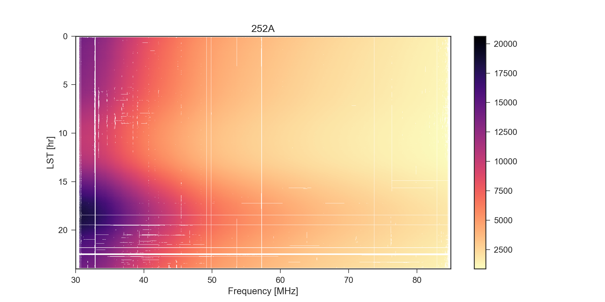
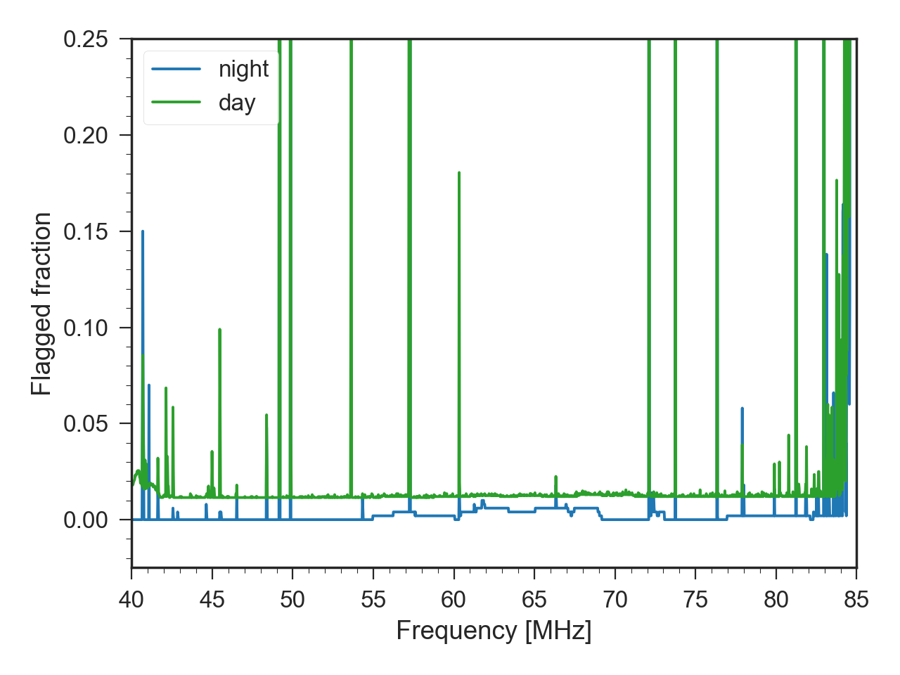
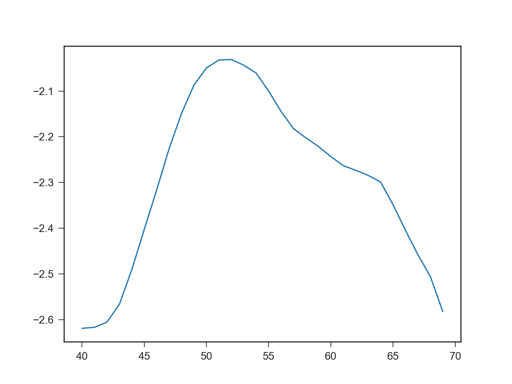
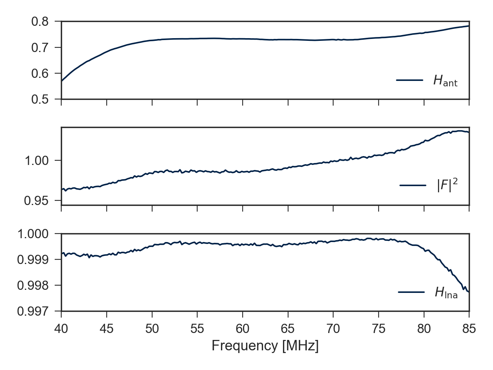
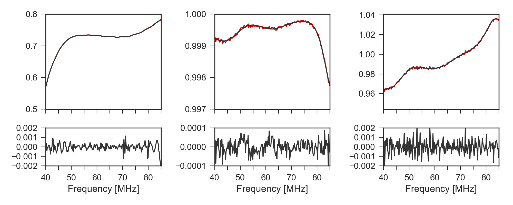
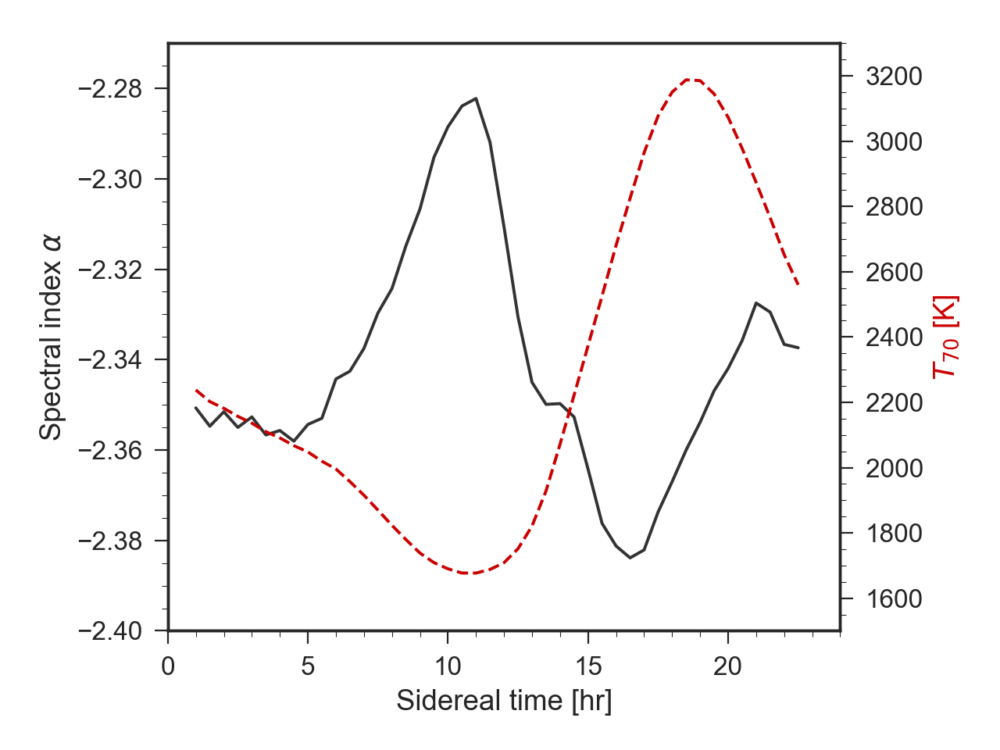

# leda_analysis_2016

Leda data analysis scripts, February 2016


## Install requirements

```
pip install seaborn
pip install lmfit
pip install hickle==2.0.5
pip install bottleneck==0.8.0
```

##Basic usage

Run scripts sequentially, with data file as argument, e.g. `./01_plot_waterfall.py data/outriggers_2017_01_01.h5`.
This is made a bit easier if you set a variable in your terminal like so:

```
> fn=/path/to/data/data.h5
> ./01_plot_waterfall.py $fn
> ./02_plot_spectra.py $fn
```


## Script overview

### 01_plot_waterfall.py


### 02_plot_spectra.py


### 02b_plot_spectra_dp.py


### 03_compare_waterfall.py


### 04_compare_spectra.py


### 05_plot_residuals.py


### 06_plot_rfi.py




### 07_fit_alpha.py



### 08_plot_fg.py



### 09_fourier_fitting.py



### 10_fit_alpha2.py

