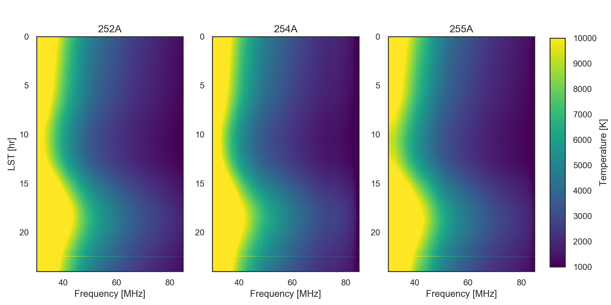
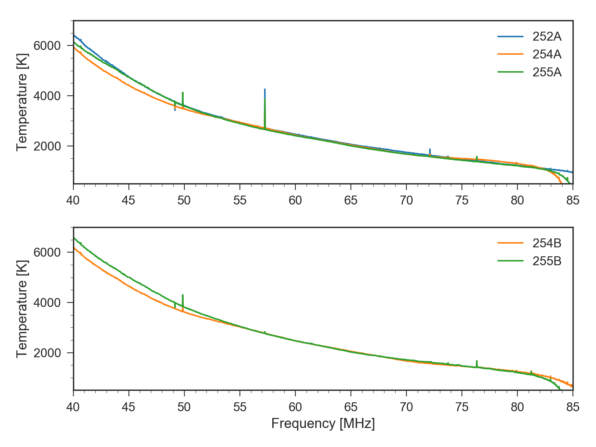
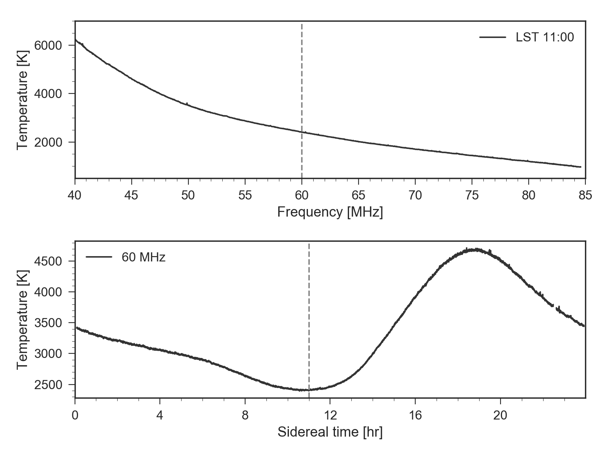
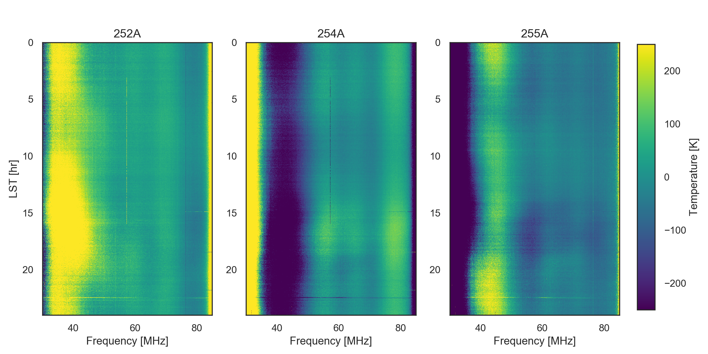

# leda_analysis_2016
Leda data analysis scripts, February 2016

## Install requirements

```
pip install seaborn
pip install hickle==2.0.5
pip install bottleneck==0.8.0
```

## Script overview

### 01_plot_waterfall.py



### 02_plot_spectra.py



### 02b_plot_spectra_dp.py



### 03_compare_waterfall.py




